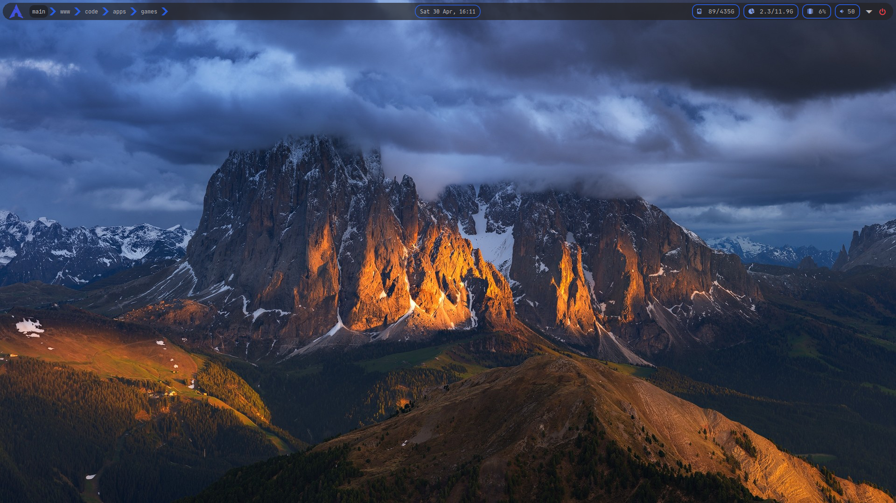
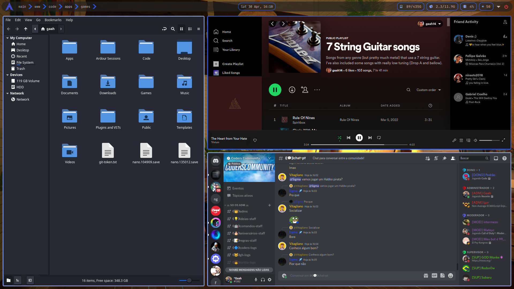
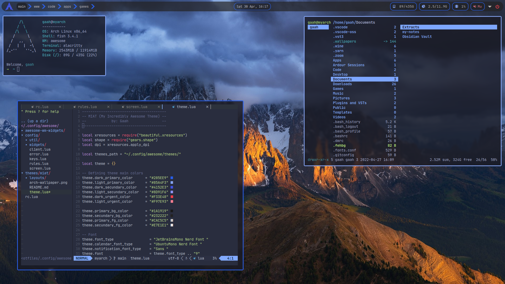

# My dotfiles

Just the config for my Linux environment. I'm using Arch Linux along side with Awesomewm.

### Needed packages
```
alacritty
alsa-utils
awesome-git
ctags
feh
firefox
fish
flameshot
lightdm
lightdm-slick-greeter
lua
lua-language-server
lxappearance
nemo
neofetch
neovim
nerd-fonts-complete
noto-fonts-emoji
papirus-icon-theme
pavucontrol
picom-ibhagwan-git
playerctl
pulseaudio
ranger
rofi
rofi-calc
rofi-emoji
rofi-power-menu
yay
```

### Screenshots







